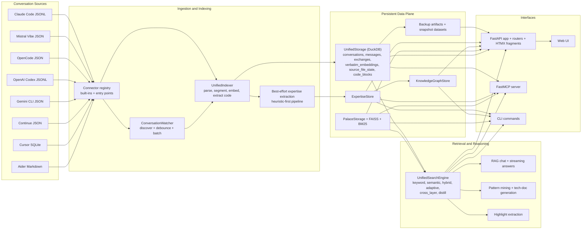
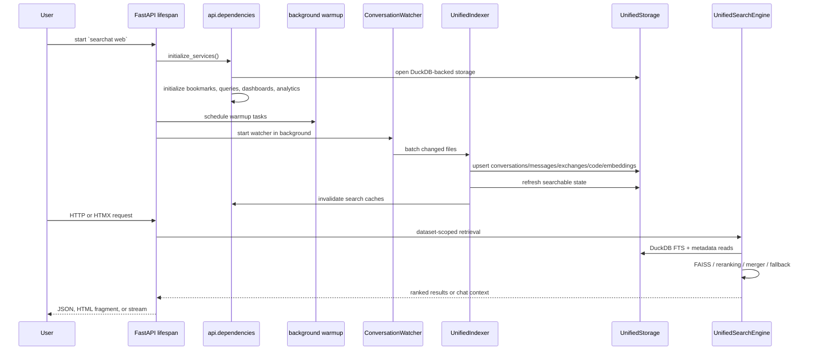
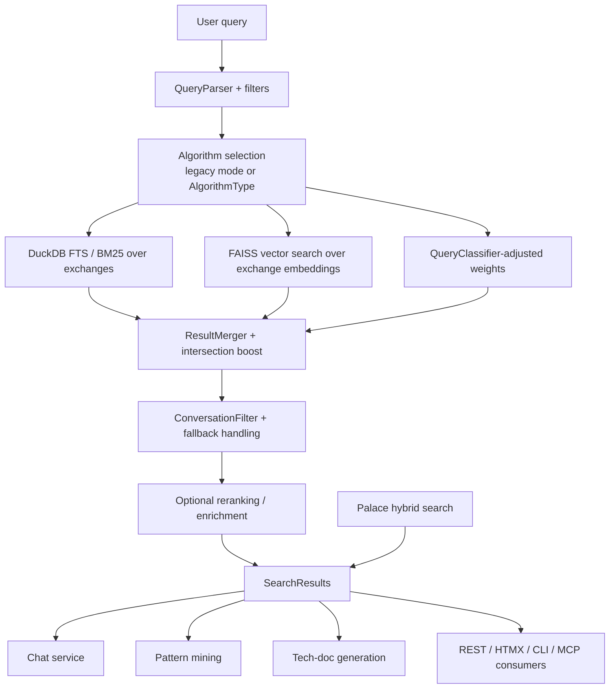

# Searchat Architecture

This document is the canonical system overview for the current codebase. It replaces earlier descriptions that were still centered on the pre-unified index and older API surface.

## System Overview

## Runtime Layers

| Layer | Current implementation | Responsibility |
| --- | --- | --- |
| Source discovery | [`src/searchat/core/connectors/registry.py`](../src/searchat/core/connectors/registry.py) + connector modules | Detects supported agent logs, resolves watch directories, supports plugin-style entry points. |
| Live indexing | [`src/searchat/core/watcher.py`](../src/searchat/core/watcher.py) + [`src/searchat/core/unified_indexer.py`](../src/searchat/core/unified_indexer.py) | Debounces file events, parses conversations, segments user→assistant exchanges, stores embeddings and code blocks, then runs expertise extraction. |
| Primary storage | [`src/searchat/storage/unified_storage.py`](../src/searchat/storage/unified_storage.py) + [`src/searchat/storage/schema.py`](../src/searchat/storage/schema.py) | Persistent DuckDB-backed store for the searchable archive and indexing metadata. |
| Retrieval | [`src/searchat/core/unified_search.py`](../src/searchat/core/unified_search.py) | Executes DuckDB FTS + FAISS retrieval, adaptive weighting, fallbacks, reranking, cross-layer and distill modes. |
| Knowledge layers | [`src/searchat/expertise/`](../src/searchat/expertise), [`src/searchat/knowledge_graph/`](../src/searchat/knowledge_graph), [`src/searchat/palace/`](../src/searchat/palace) | Extracts reusable expertise, links contradictions/lineage, and supports distilled memory search. |
| Serving surfaces | [`src/searchat/api/`](../src/searchat/api), [`src/searchat/mcp/`](../src/searchat/mcp), [`src/searchat/cli/`](../src/searchat/cli), [`src/searchat/web/`](../src/searchat/web) | Exposes the archive through REST, HTMX fragments, MCP tools, CLI workflows, and the browser UI. |

## Startup and Request Lifecycle

## Data Plane

### Core indexed dataset

| Table / store | Purpose | Produced by |
| --- | --- | --- |
| `conversations` | Conversation-level metadata and full text | `UnifiedIndexer._write_conversation()` |
| `messages` | Ordered message stream for each conversation | `UnifiedIndexer.index_append_only()` |
| `exchanges` | User→assistant exchange segmentation, the main retrieval unit | `_segment_exchanges()` in `UnifiedIndexer` |
| `verbatim_embeddings` | Exchange embeddings for semantic retrieval | `UnifiedIndexer._embed_exchanges()` |
| `source_file_state` | Incremental indexing state and connector provenance | `UnifiedIndexer.index_append_only()` |
| `code_blocks` | Extracted fenced code + symbol metadata | `UnifiedIndexer._write_code_blocks()` |

### Auxiliary stores

| Store | Backing implementation | Role in the system |
| --- | --- | --- |
| Expertise store | Local DuckDB/Parquet-backed expertise subsystem | Reusable conventions, failures, decisions, boundaries, and onboarding material. |
| Knowledge graph | [`KnowledgeGraphStore`](../src/searchat/knowledge_graph/store.py) | Contradictions, lineage, resolution workflows, and graph stats over expertise records. |
| Palace | `PalaceStorage` + palace FAISS/BM25 indexes | Distilled memory layer used directly via `/api/palace/*` and via `distill` / `cross_layer` search modes. |
| Backups and snapshots | [`BackupManager`](../src/searchat/services/backup.py) | Backup chains, validation, restore, and read-only dataset browsing. |

## Search and Reasoning Path

### What is true in the current code

| Topic | Current state |
| --- | --- |
| Default retrieval backend | `UnifiedSearchEngine` built by `build_retrieval_service()` |
| Default storage backend | `UnifiedStorage` built by `build_storage_service()` |
| Core search modes | `keyword`, `semantic`, `hybrid` |
| Extended algorithm types | `adaptive`, `cross_layer`, `distill` |
| Distilled memory integration | Palace search is real and lazily loaded; `distill` and `cross_layer` are implemented in `UnifiedSearchEngine` when palace is enabled. |
| Snapshot reads | Storage and retrieval can be resolved against backup directories through dataset-scoped helpers. |
| RAG readiness | Semantic readiness is checked per request for chat and other semantic workflows. |

## Interface Surface

| Surface | Current role | Representative modules |
| --- | --- | --- |
| REST API | Main integration surface for search, chat, indexing, backup, analytics, expertise, knowledge graph, palace | `src/searchat/api/app.py`, `src/searchat/api/routers/*.py` |
| HTMX fragments | Server-rendered partials for search, dashboards, contradictions, management views | `src/searchat/api/routers/fragments.py`, `src/searchat/web/templates/fragments/` |
| Web UI | Browser shell, navigation, search workflows, chat, dashboards, contradictions, bookmarks | `src/searchat/web/templates/`, `src/searchat/web/static/js/modules/` |
| CLI | Search, setup, health, expertise, contradictions, knowledge graph, distillation, validation, CI checks | `src/searchat/cli/main.py` + command modules |
| MCP | Tool bridge for search, chat-over-history, expertise priming/recording, palace search | `src/searchat/mcp/server.py`, `src/searchat/mcp/tools.py` |

## Architectural Corrections From The Older Version

The earlier architecture description is no longer accurate in these ways:

| Older framing | Current reality |
| --- | --- |
| Search centered on older `search_engine.py` / conversation-level retrieval | Search is centered on `UnifiedSearchEngine` with exchange-level retrieval and optional palace merge. |
| Index storage described as Parquet + FAISS as the primary architecture | The active storage contract is `UnifiedStorage` backed by a persistent DuckDB database; FAISS remains part of semantic retrieval. |
| API described as a smaller router set | The FastAPI surface now includes search, conversations, code, chat, docs, patterns, dashboards, expertise, knowledge graph, health, fragments, backup, status, palace, and more. |
| Architecture omitted higher-order memory systems | Expertise, contradiction-aware knowledge graph, and palace distillation are now first-class subsystems. |
| Connectors framed as a narrow set | The current connector layer supports eight built-in agents plus entry-point extensibility. |

## Code Pointers

| Concern | Primary file |
| --- | --- |
| App lifecycle and router wiring | [`src/searchat/api/app.py`](../src/searchat/api/app.py) |
| Dependency graph and lazy singletons | [`src/searchat/api/dependencies.py`](../src/searchat/api/dependencies.py) |
| Dataset-scoped snapshot routing | [`src/searchat/api/dataset_access.py`](../src/searchat/api/dataset_access.py) |
| Indexing pipeline | [`src/searchat/core/unified_indexer.py`](../src/searchat/core/unified_indexer.py) |
| Retrieval engine | [`src/searchat/core/unified_search.py`](../src/searchat/core/unified_search.py) |
| Unified DuckDB storage | [`src/searchat/storage/unified_storage.py`](../src/searchat/storage/unified_storage.py) |
| Connector registry | [`src/searchat/core/connectors/registry.py`](../src/searchat/core/connectors/registry.py) |
| Expertise pipeline | [`src/searchat/expertise/pipeline.py`](../src/searchat/expertise/pipeline.py) |
| Knowledge graph | [`src/searchat/knowledge_graph/store.py`](../src/searchat/knowledge_graph/store.py) |
| Palace query/distillation | [`src/searchat/palace/query.py`](../src/searchat/palace/query.py), [`src/searchat/palace/distiller.py`](../src/searchat/palace/distiller.py) |
